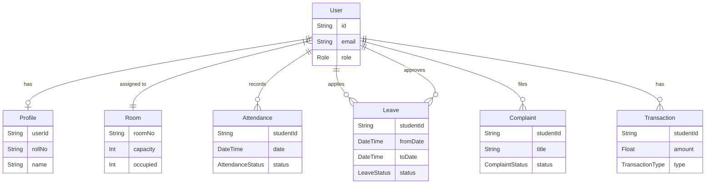

# Database Schema Documentation

This document provides an overview of the database schema for the Hostel Management System. The database is managed using Prisma ORM with PostgreSQL.

## Overview

The schema consists of the following main models:

- **User**: Central entity for authentication and user management.
- **Profile**: Extended information for users (one-to-one with User).
- **Room**: Manages hostel room allocation.
- **Attendance**: Tracks daily student attendance.
- **Leave**: Manages leave requests and approvals.
- **Complaint**: Handles student complaints and their resolution status.
- **Transaction**: Records financial transactions (fees, etc.).

## Enums

### Role

Defines the user's role in the system.

- `STUDENT`
- `WARDEN`
- `ADMIN`

### AttendanceStatus

- `PRESENT`
- `ABSENT`
- `LATE`

### LeaveStatus

- `PENDING`
- `APPROVED`
- `REJECTED`

### TransactionType

- `CREDIT`
- `DEBIT`

### ComplaintStatus

- `PENDING`
- `IN_PROGRESS`
- `RESOLVED`

## Models

### User

Represents a system user (Student, Warden, or Admin).

| Field     | Type     | Constraints      | Description             |
| --------- | -------- | ---------------- | ----------------------- |
| id        | String   | PK, CUID         | Unique Identifier       |
| email     | String   | Unique           | User's email address    |
| password  | String?  |                  | Hashed password         |
| role      | Role     | Default: STUDENT | User role               |
| profile   | Profile? |                  | Relation to Profile     |
| roomId    | String?  | FK               | ID of the assigned room |
| createdAt | DateTime | Default: now()   | Creation timestamp      |

**Relations:**

- `profile`: One-to-one with `Profile`.
- `room`: Many-to-one with `Room` (Student resides in Room).
- `attendance`: One-to-many with `Attendance` (Student's attendance).
- `leaves`: One-to-many with `Leave` (Leaves applied by Student).
- `approvedLeaves`: One-to-many with `Leave` (Leaves approved by User/Warden).
- `complaints`: One-to-many with `Complaint`.
- `transactions`: One-to-many with `Transaction`.

### Profile

Contains detailed information about the user.

| Field       | Type    | Constraints | Description             |
| ----------- | ------- | ----------- | ----------------------- |
| id          | String  | PK, CUID    | Unique Identifier       |
| userId      | String  | Unique, FK  | Reference to User       |
| name        | String  |             | Full Name               |
| rollNo      | String  | Unique      | Student Roll Number     |
| phone       | String  |             | Contact Number          |
| parentPhone | String? |             | Parent's Contact Number |
| photo       | String? |             | URL to profile photo    |
| course      | String  |             | Course Name             |
| year        | Int     |             | Current Year            |
| address     | String? |             | Permanent Address       |

### Room

Represents a hostel room.

| Field    | Type   | Constraints | Description             |
| -------- | ------ | ----------- | ----------------------- |
| id       | String | PK, CUID    | Unique Identifier       |
| roomNo   | String | Unique      | Room Number             |
| floor    | Int    |             | Floor Number            |
| capacity | Int    |             | Total beds in room      |
| occupied | Int    | Default: 0  | Currently occupied beds |

**Relations:**

- `students`: One-to-many with `User`.

### Attendance

Tracks daily attendance logs.

| Field     | Type             | Constraints      | Description          |
| --------- | ---------------- | ---------------- | -------------------- |
| id        | String           | PK, CUID         | Unique Identifier    |
| studentId | String           | FK               | Reference to Student |
| date      | DateTime         |                  | Date of attendance   |
| inTime    | DateTime?        |                  | Entry time           |
| outTime   | DateTime?        |                  | Exit time            |
| status    | AttendanceStatus | Default: PRESENT | Attendance status    |

### Leave

Manages leave applications.

| Field        | Type        | Constraints      | Description                    |
| ------------ | ----------- | ---------------- | ------------------------------ |
| id           | String      | PK, CUID         | Unique Identifier              |
| studentId    | String      | FK               | Reference to Student           |
| fromDate     | DateTime    |                  | Start date                     |
| toDate       | DateTime    |                  | End date                       |
| reason       | String      |                  | Reason for leave               |
| status       | LeaveStatus | Default: PENDING | Approval status                |
| approvedById | String?     | FK               | Reference to Approver (Warden) |
| createdAt    | DateTime    | Default: now()   | Application timestamp          |

### Complaint

Handles grievance redressal.

| Field       | Type            | Constraints      | Description             |
| ----------- | --------------- | ---------------- | ----------------------- |
| id          | String          | PK, CUID         | Unique Identifier       |
| studentId   | String          | FK               | Reference to Student    |
| title       | String          |                  | Complaint title         |
| description | String          |                  | Detailed description    |
| image       | String?         |                  | URL to supporting image |
| status      | ComplaintStatus | Default: PENDING | Resolution status       |
| resolvedAt  | DateTime?       |                  | Resolution timestamp    |

### Transaction

Records financial history.

| Field       | Type            | Constraints    | Description           |
| ----------- | --------------- | -------------- | --------------------- |
| id          | String          | PK, CUID       | Unique Identifier     |
| studentId   | String          | FK             | Reference to Student  |
| amount      | Float           |                | Transaction amount    |
| type        | TransactionType |                | Credit or Debit       |
| description | String          |                | Transaction details   |
| date        | DateTime        | Default: now() | Transaction timestamp |

## ER Diagram

